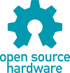

# piphons
_Phone line interface with DTMF decoder and speech synthesis for Pi board_

## Features

This project allows to connect a Pi board to a telephone line in order to 
create a voice server with DTMF decoding.

The PiPhons shield has the following features : 

* Compatibilty with the [Raspberry Pi GPIO connectors](https://www.raspberrypi.org/documentation/usage/gpio/) (26 or 40-pin) and the 
[Mini shield for Nano Pi NEO Core/Core 2](http://wiki.friendlyarm.com/wiki/index.php/Mini_Shield_for_NanoPi_NEO_Core/Core2).  
* Isolated telephone interface compliant with the telephone network standards of all countries.
This is the dry version described in the application note [AN-5](https://github.com/epsilonrt/piphons/raw/master/extras/hardware/doc/randolph-telecom-an5.pdf) 
from [Randolph Telecom](http://www.randolph-telecom.com/).
  - This interface is equipped with an LED to signal ringtones and another indicating that the telephone line is unhooked.  
  - It also has a tone decoder (PLL) that can detect that the remote party has hung up.  
* Integrated DTMF decoder [HT9170D](http://www.holtek.com/documents/10179/116711/9170v111.pdf) very reliable.
* Quality speech synthesis in English, German, Spanish, French and Italian.

Published in open-source hardware, it comes with :  
* this library,  
* [electronic schematic](extras/hardware/piphons-shield-sch.pdf),  
* [manufacturing files](extras/hardware/gerber) and [Proteus CAD files](extras/hardware/proteus).

 
  

A telephone line interface, also called a DAA or Data Access Arrangement, 
provides the connective circuitry between subscriber equipment, such as fax, 
modem or answering machine, and the telephone line. 

The primary purpose of the telephone interface circuit is to protect the 
telephone line from damage in the event of a problem on the subscriber side.

[Dual-tone multi-frequency signaling](https://en.wikipedia.org/wiki/Dual-tone_multi-frequency_signaling) 
(DTMF) is an in-band telecommunication 
signaling system using the voice-frequency band over telephone lines between 
telephone equipment and other communications devices and switching centers. 

DTMF was first developed in the Bell System in the United States, and became 
known under the trademark Touch-Tone for use in push-button telephones supplied 
to telephone customers, starting in 1963.

## How to connect your shield to your board ?

The PiPhons shield must be connected to the Pi board by the GPIO connector and the output jack.

The GPIO P1 connector is a 26-pin connector that is compatible with the Raspberry Pi 
connectors (26 or 40-pin) and the [Mini shield for Nano Pi NEO Core/Core 2](http://wiki.friendlyarm.com/wiki/index.php/Mini_Shield_for_NanoPi_NEO_Core/Core2).

The sound output should be directed to the jack using `raspi-config` or `armbian-config`. 
It is by this plug that the sound signal of synthetic speech reaches the shield then the telephone line.

It will therefore connect the J2 plug of the shield to the jack of the board Pi.

## How to install the library ?

The fastest and safest way to install PiPhons library on Armbian is to use the APT 
repository from [piduino.org](http://apt.piduino.org), so you should do the following :

    wget -O- http://www.piduino.org/piduino-key.asc | sudo apt-key add -
    sudo add-apt-repository 'deb http://apt.piduino.org stretch piduino'
    sudo apt update
    sudo apt install libpiphons-dev
    
This repository provides PiPhons library packages for `armhf` and `arm64` architectures.

For Raspbian you have to do a little different :

    wget -O- http://www.piduino.org/piduino-key.asc | sudo apt-key add -
    echo 'deb http://raspbian.piduino.org stretch piduino' | sudo tee /etc/apt/sources.list.d/piduino.list
    sudo apt update
    sudo apt install libpiphons-dev

The Raspbian repository provides PiPhons library packages for `armhf` architecture for Stretch only.

If you want to build from sources, you can follow the 
[Wiki](https://github.com/epsilonrt/piphons/wiki/Build-from-source).

## How to use the library in your program ?

The easiest way to know how to use the PiPhons library in your program and to consult the examples provided with.

* The phone line is managed using the [Daa class](https://github.com/epsilonrt/piphons/blob/master/examples/daa-demo/main.cpp)  
* DTMF key decoding is handled using the [Dtmf class](https://github.com/epsilonrt/piphons/blob/master/examples/dtmf-demo/main.cpp)  
* Speech synthesis is managed using the [Tts class](https://github.com/epsilonrt/piphons/blob/master/examples/tts-demo/main.cpp) (for text to speech)  

To build your program, you must type the command:

    $ g++ -o tts-demo main.cpp $(pkg-config --cflags --libs libpiphons)
    
You can then execute the program :

    $ sudo ./tts-demo

`sudo` is necessary for an access to the memory mapping of the GPIO. 
You can enable the **setuid** bit to avoid `sudo` in the future :

    $ sudo chmod u+s tts-demo
    $ ./tts-demo

With [Codelite](https://codelite.org/) it's easier and funny, right ? 

The `libpiphons-dev` package installs a project template in Codelite...

------
