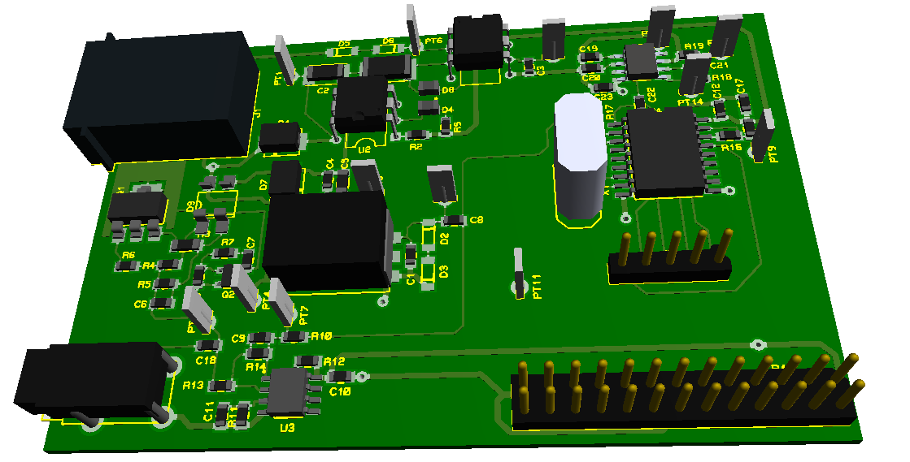

# daadtmf
_Phone line interface with DTMF decoder for Pi board_

## Features

This project allows to connect a Pi board to a telephone line in order to 
create a voice server with DTMF decoding.

A telephone line interface, also called a DAA or Data Access Arrangement, 
provides the connective circuitry between subscriber equipment, such as fax, 
modem or answering machine, and the telephone line. 

The primary purpose of the telephone interface circuit is to protect the 
telephone line from damage in the event of a problem on the subscriber side.

[Dual-tone multi-frequency signaling](https://en.wikipedia.org/wiki/Dual-tone_multi-frequency_signaling) 
(DTMF) is an in-band telecommunication 
signaling system using the voice-frequency band over telephone lines between 
telephone equipment and other communications devices and switching centers. 

DTMF was first developed in the Bell System in the United States, and became 
known under the trademark Touch-Tone for use in push-button telephones supplied 
to telephone customers, starting in 1963.

 
  

Its features are as follows :   

**TODO**

Published in open-source hardware, it comes with :  
* this library,  
* [electronic schematic](extras/hardware/daa-dtmf-shield-sch.pdf),  
* [manufacturing files](extras/hardware/gerber) and [Proteus CAD files](extras/hardware/proteus).

## How to connect your shield to your board ?

**TODO**

## How to install the library ?

**TODO**

## How to use the library in your program ?

**TODO**

------
